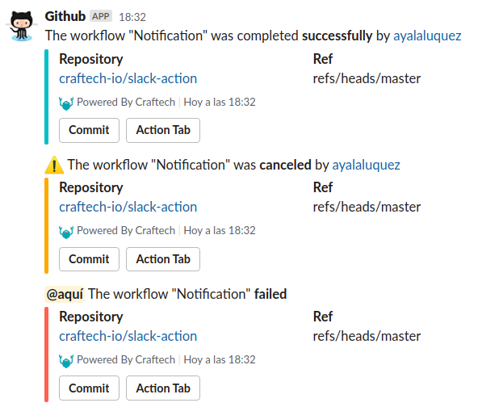

# Slack Action

This action send notification current status of the job. Possible values are success, failure, or cancelled.

First steps, you need to set GitHub secrets for SLACK_WEBHOOK_URL that is Incoming Webhook URL.
You can customize the following parameters:

- [Sending messages using Incoming Webhooks](https://slack.com/help/articles/115005265063-Incoming-Webhooks-for-Slack)
- [Creating and storing encrypted secrets](https://help.github.com/es/actions/configuring-and-managing-workflows/creating-and-storing-encrypted-secrets)

## Inputs variables

| With Parameter        | Required/Optional | Description |
| --------------------- | ----------------- | ------------|
| `SLACK_WEBHOOK_URL`   | **Required**      | Slack Incoming Webhooks URL. <br>[Please specify this key or SLACK_WEBHOOK_URL environment secret](https://help.github.com/es/actions/configuring-and-managing-workflows/creating-and-storing-encrypted-secrets)  
| `STATUS`              | ***Optional***     | The result of GitHub Actions job<br>This parameter value must contain the following word:<br>- `success`<br>- `failure`<br>- `cancelled`<br> default is using ${{ job.status }}
| `SLACK_CHANNEL`       | **Optional**      | Override the default incoming Webhook Slack settings 
| `SLACK_USERNAME`      | **Optional**      | Override the default incoming Webhook Slack settings 


## Example 

usage with the default incoming Webhook Slack settings, 

Create the file `workflow.yml` in `.github/workflows` folder. 


``` yaml

name: Your Workflow
on [push]

jobs:
  deploy:
    runs-on: ubuntu-latest
    steps:
      - uses: craftech-io/slack-action@v1
        with:
          slack_webhook_url: ${{secrets.SLACK_WEBHOOK_URL}}
        if: always()
  
```
## Scenarios

You can override the default incoming Webhook Slack settings for the channel and username, also only send notification to slack if the job failure, example: 

Possible values are success, failure, or cancelled.


``` yaml

name: Your Workflow
on [push]

jobs:
  deploy:
    runs-on: ubuntu-latest
    steps:
      - uses: craftech-io/slack-action@v1
        with:
          slack_webhook_url: ${{secrets.SLACK_WEBHOOK_URL}}
          slack_channel: general
          slack_username: Github
          status: failure
        if: failure()
  
```


## Slack UI

Locate the Slack conversation the message was sent to and it should be waiting for you, like this:




Amazing work - you've now implemented notifactions the your workflows!
